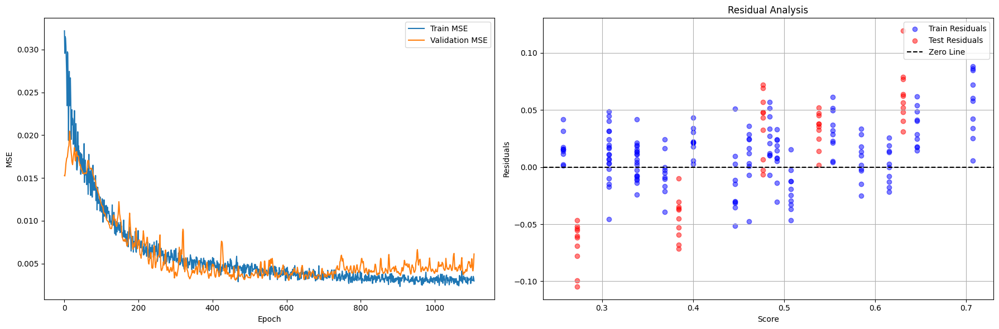
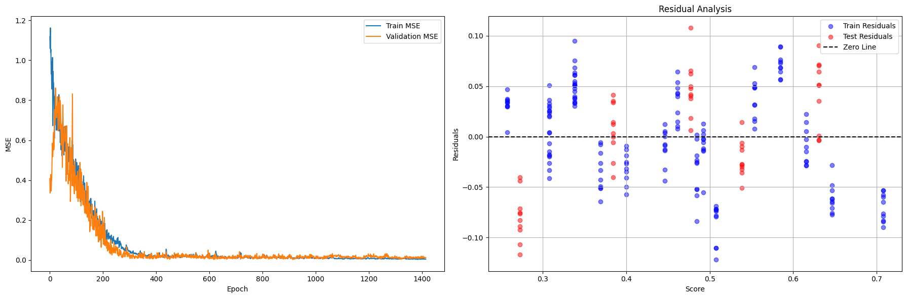
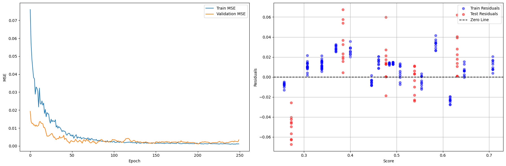
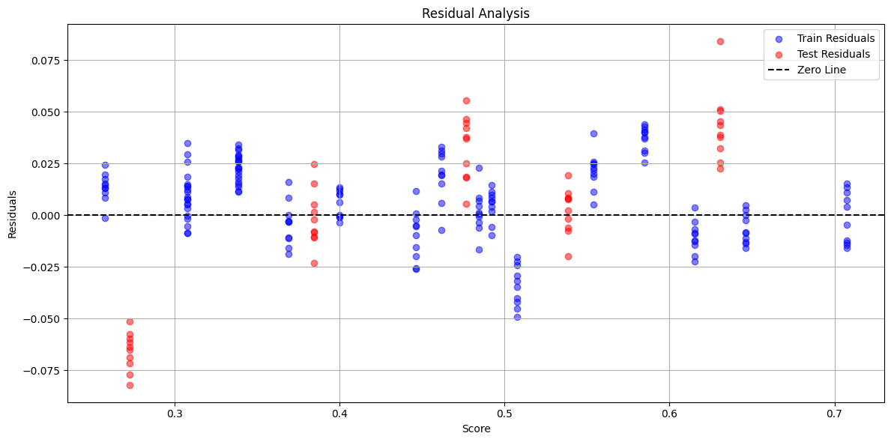
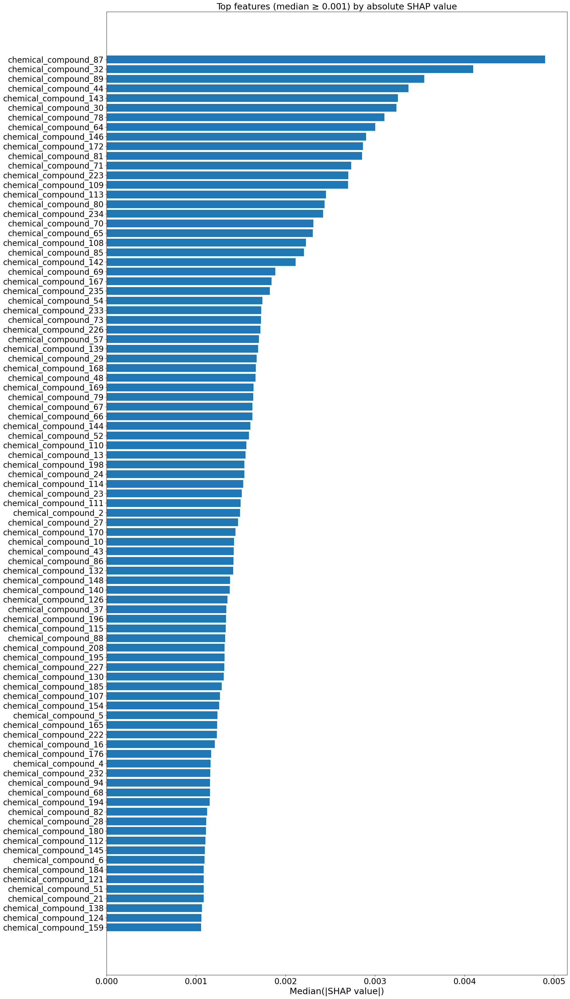
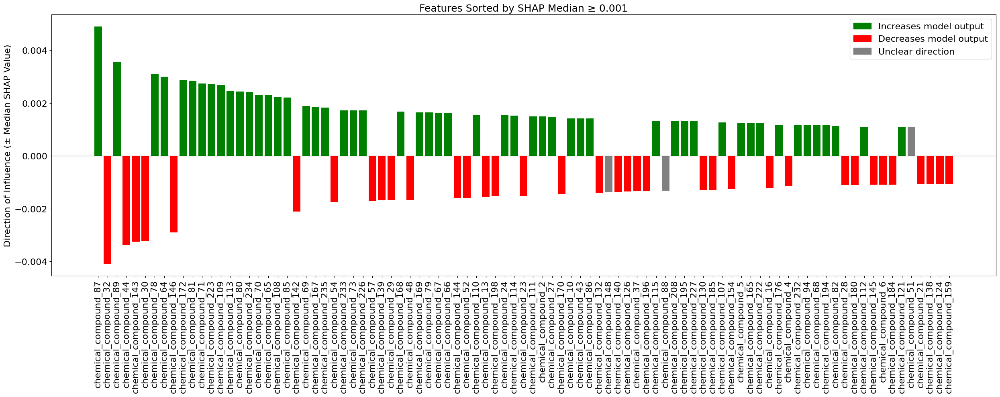
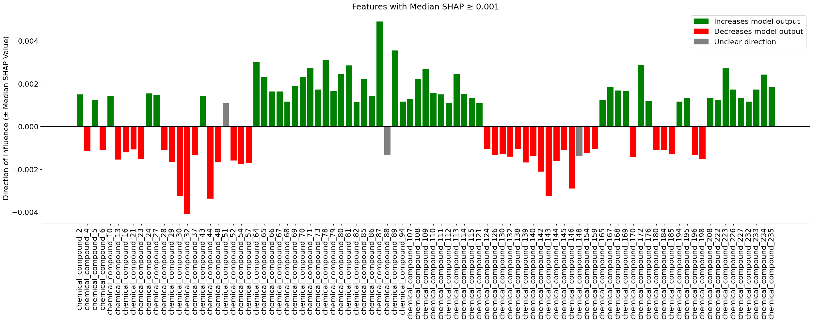
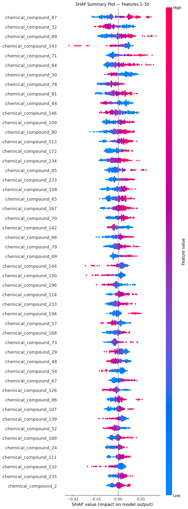
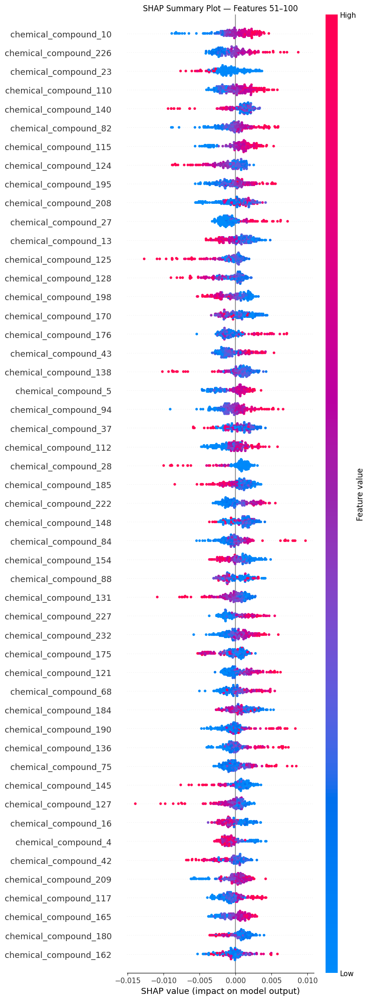

# 🍺 Beer_Prediction_Neural_Network

**Prediction of non-alcoholic beer ratings based on chemical compositions using neural networks**

This bachelor thesis focuses on predicting consumer ratings of non-alcoholic beers using deep learning models built on chemical composition data. The primary goal is to analyze relationships between chemical properties and consumer preferences, identify the most impactful features, and interpret model explainability using SHAP values.  
The results help improve understanding of how specific chemical attributes influence beer preference and can support production optimization in the beverage industry.

**Keywords:** *Convolutional Neural Network (CNN), Deep Neural Network (DNN), Keras, SHAP, Explainable AI, Sensory Evaluation*

---

## 📁 Repository Structure


---

## 🧠 Neural Network Training Results (Visualization)

Below are the **training and validation performance plots** for all implemented models:

### 🔹 Convolutional Neural Network


---

### 🔹 Dual-Branch Neural Network


---

### 🔹 Deep Fully Connected Neural Network


---

### 🔹 Ensemble Model Comparison


---

## 🔍 Explainability — SHAP Results

### Global Feature Importance (Median Absolute Impact)


---

### Positive vs Negative Influence


---

### Sorted Feature Impact (Ingredients)


---

### Detailed Feature Summary (Rank 1–100)
#### Top 1–50


#### Top 51–100


---

## 🚀 Usage

1. Open and run `main.ipynb` for full workflow (preprocessing → training → evaluation).
2. Alternative models and experimental variations are in `models_NN.ipynb`.
3. Run SHAP visualizations via:  
   ```bash
   python shap_plots.py
